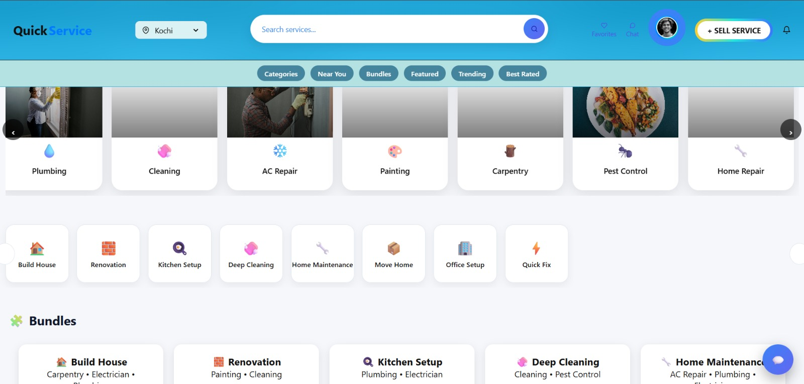
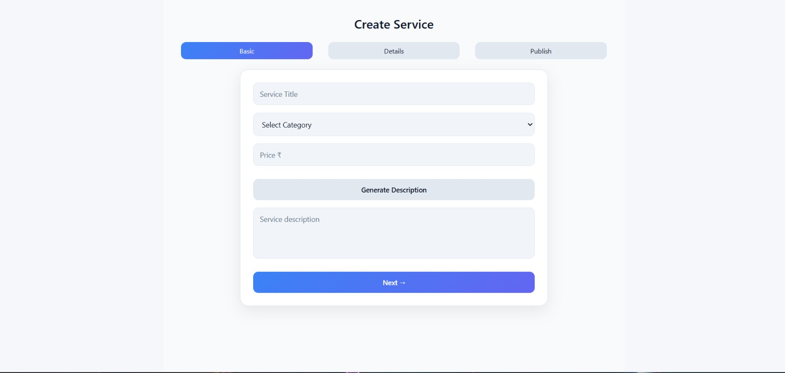
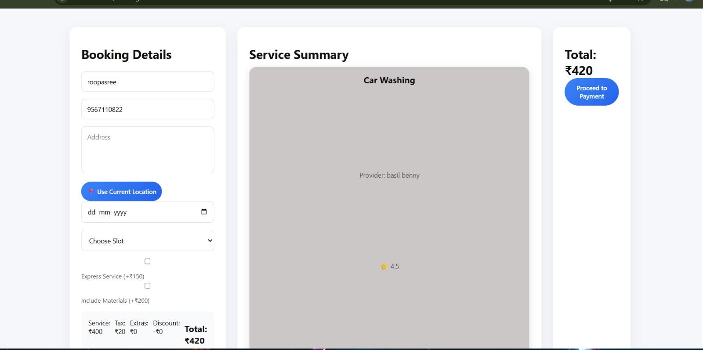

# Quick Service

A full-stack MERN (MongoDB, Express.js, React.js, Node.js) service marketplace platform that connects customers with service providers across multiple categories. The platform primarily focuses on home services such as plumbing, electrical work, cleaning, painting, and carpentry, while also supporting other professional and local services.

## Project Overview

Quick Service is a web-based platform designed to simplify the process of finding, booking, and managing services online. Customers can browse available services, compare providers, make bookings, and track their service requests through an intuitive interface.

Service providers can register on the platform, create service listings, manage bookings, and interact with customers. Administrators oversee the platform by managing users, providers, services, and overall system operations.

The system serves as a scalable marketplace that can support a wide range of service categories, making it adaptable for both home-service and general service-based business models.

## Features

* Multi-category Service Marketplace
* User, Provider, and Admin Roles
* JWT-Based Authentication & Authorization
* Service Listing & Management
* Booking Management System
* Review & Rating System
* Image Upload Support
* Interactive Maps & Location Services
* AI-Powered Features using Google Gemini API
* Real-Time Communication with Socket.io
* PDF Generation & Reporting
* Responsive Modern UI
* RESTful API Architecture

## Tech Stack

### Frontend

* React.js
* Vite
* React Router
* Axios
* Framer Motion
* GSAP
* React Leaflet
* Recharts

### Backend

* Node.js
* Express.js
* JWT Authentication
* Socket.io
* Multer

### Database

* MongoDB
* Mongoose

### Other Tools

* Git & GitHub
* Postman
* Google Gemini API

## Project Structure

```bash
quick-service/
│
├── client/
│   ├── src/
│   ├── public/
│   └── package.json
│
├── server/
│   ├── controllers/
│   ├── models/
│   ├── routes/
│   ├── middleware/
│   ├── uploads/
│   └── package.json
│
├── README.md
└── .gitignore
```

## Installation

### Clone Repository

```bash
git clone https://github.com/your-username/quick-service.git
cd quick-service
```

### Backend Setup

```bash
cd server
npm install
```

Create a `.env` file:

```env
PORT=5000
MONGO_URI=your_mongodb_connection_string
JWT_SECRET=your_secret_key
```

Start the backend:

```bash
npm start
```

### Frontend Setup

```bash
cd client
npm install
npm run dev
```

Frontend: http://localhost:5173

Backend: http://localhost:5000

## Security Features

* JWT Authentication
* Protected Routes
* Role-Based Access Control
* API Security Middleware
* Rate Limiting
* Secure Password Handling

## Testing

The application was tested using Postman and manual end-to-end testing to verify:

* Authentication & Authorization
* CRUD Operations
* Booking Workflow
* Review System
* Error Handling
* Role-Based Access Control

## Screenshots

### Home Page


### Service Creation


### Service Booking

## License

This project is developed for educational and portfolio purposes.

## Acknowledgements

* MongoDB
* Express.js
* React.js
* Node.js
* Socket.io
* Google Gemini API
* Leaflet Maps

Built with the MERN Stack.
